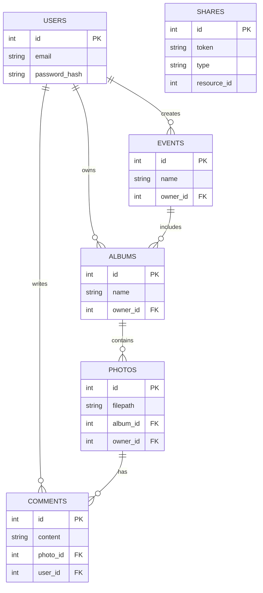
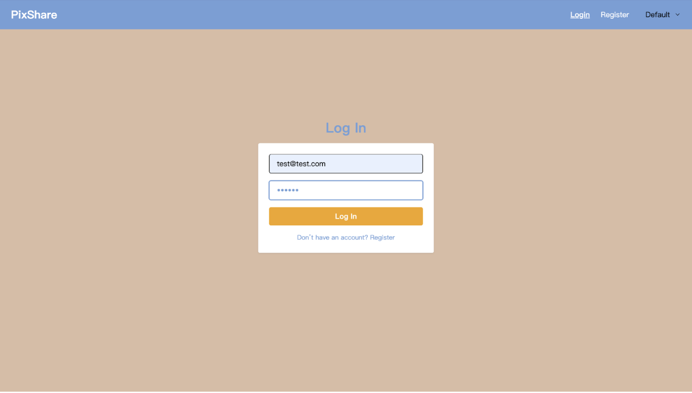
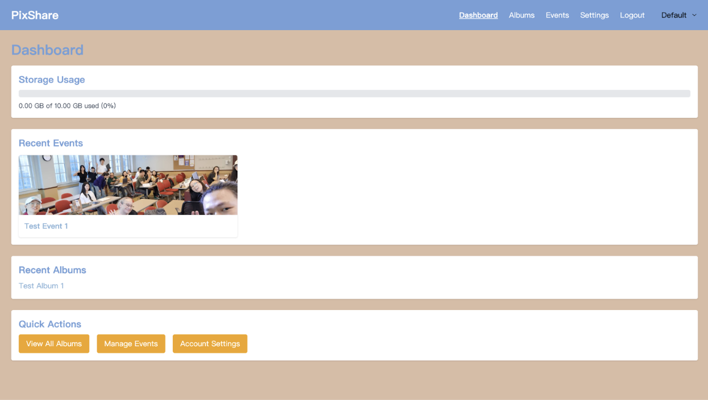
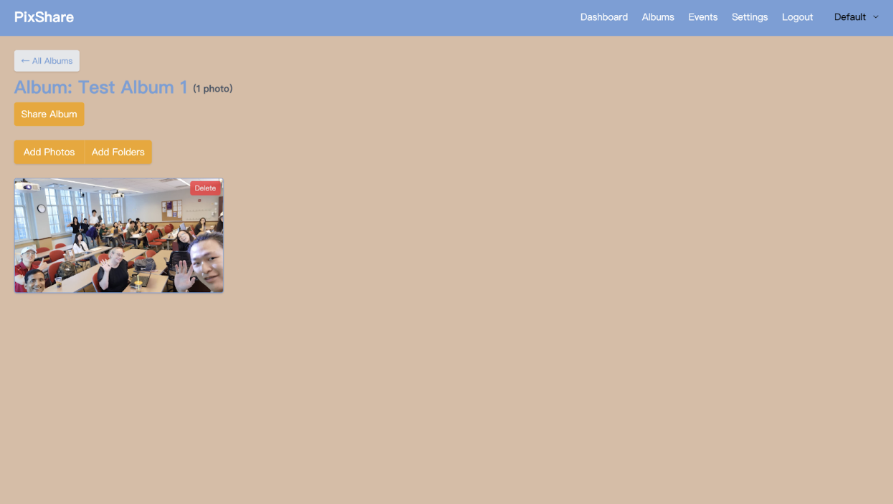
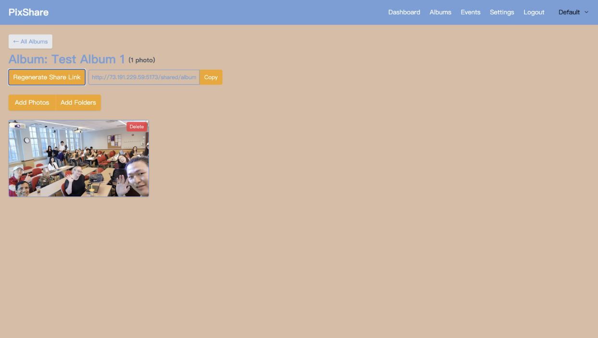
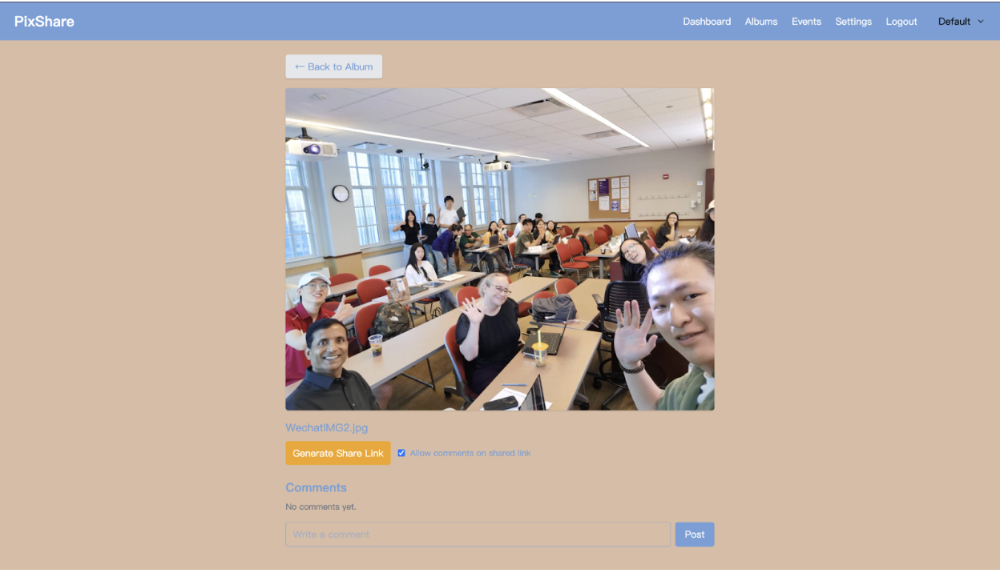
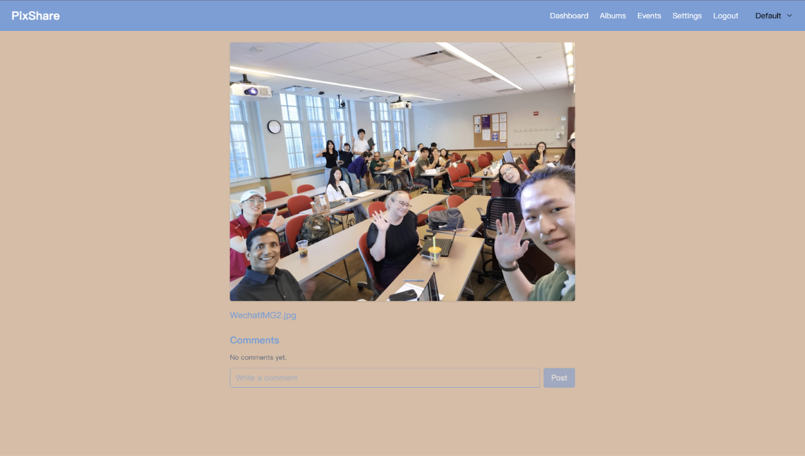
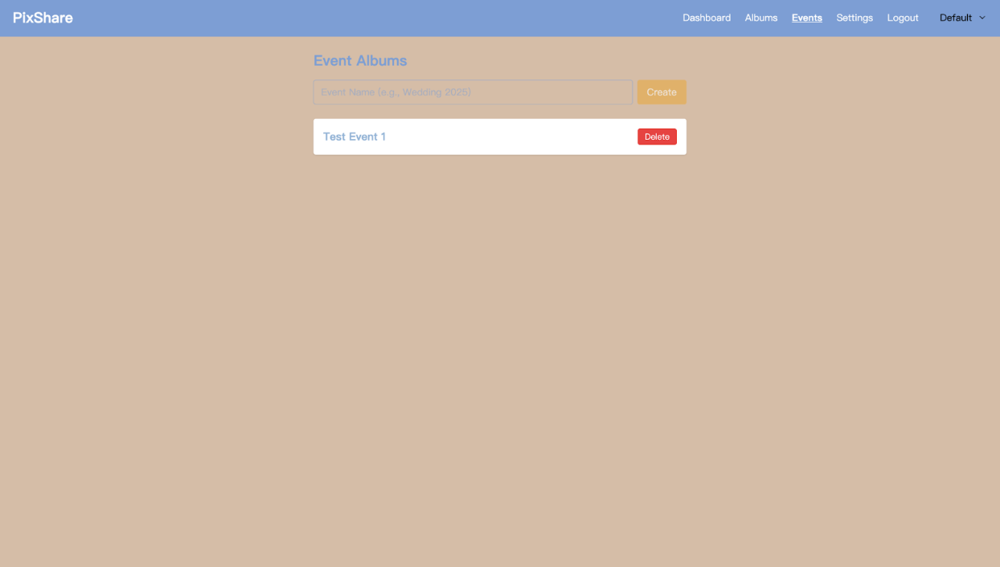
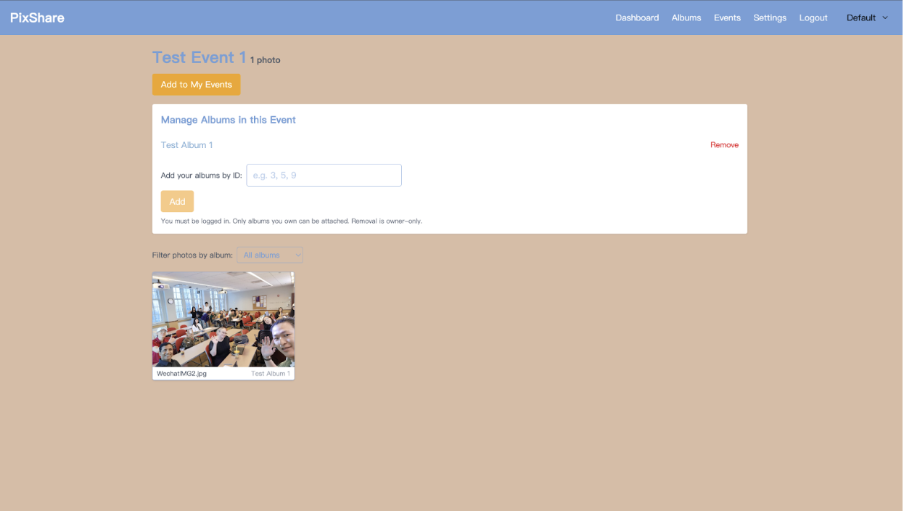
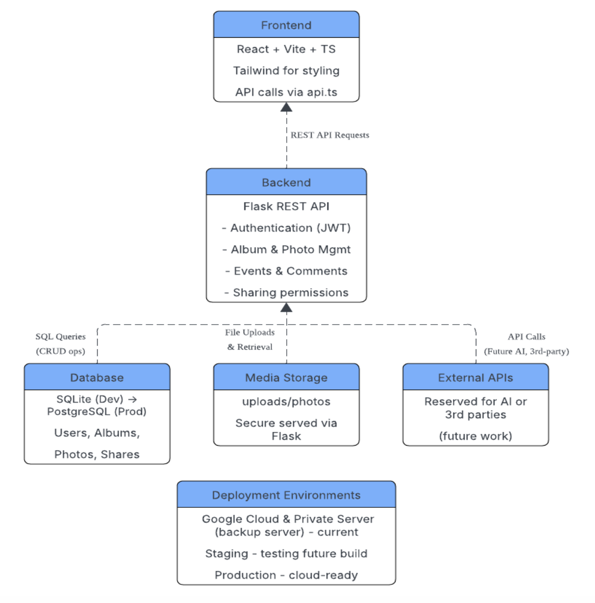

# PixShare System Documentation

## Table of Contents
- [1. Production Support Document & Testing Scenarios](#1-production-support-document--testing-scenarios)
  - [1.1 Service Dependency Diagram](#11-service-dependency-diagram-front-end-back-end-database-cloud-resources-apis)
  - [1.2 Monitoring](#12-monitoring-logs-location-component-health-checks-etc)
  - [1.3 Common Incidents & Recovery Steps](#13-common-incidents--recovery-steps)
  - [1.4 Testing Scenarios & Results](#14-testing-scenarios--results)
- [2. System Setup Instructions](#2-system-setup-instructions-frontend-backend-database)
  - [2.1 Prerequisites](#21-prerequisites)
  - [2.2 Installation Steps](#22-installation-steps)
  - [2.3 Configuration](#23-configuration)
  - [2.4 Build & Deployment](#24-build--deployment)
  - [2.5 Validation](#25-validation)
  - [2.6 ERD](#26-erd)
- [3. Issue Diagnosis, Research, Resolution & Verification](#3-issue-diagnosis-research-resolution--verification)
- [4. System Usage Guide](#4-system-usage-guide)
- [5. Architecture Diagram](#5-architecture-diagram)
- [6. Additional Sections](#6-additional-sections)
  - [6.1 Security Considerations](#61-security-considerations)
  - [6.2 Project Management Methodologies](#62-project-management-methodologies)
  - [6.3 Business Continuity & Disaster Recovery (BCDR) Plan](#63-business-continuity--disaster-recovery-bcdr-plan)
  - [6.4 Risk Management Summary](#64-risk-management-summary)

---

# 1. Production Support Document & Testing Scenarios

## 1.1 Service Dependency Diagram (Front-end, Back-end, Database, Cloud Resources, APIs)
```mermaid
flowchart LR
    subgraph Client
      A[Browser<br/>React App]
    end

    subgraph FE[Frontend (React + TypeScript)]
      B[Static assets<br/>/index.html, /assets/**]
    end

    subgraph BE[Backend (Flask)]
      C[/Flask App :5172/]
      C -->|Blueprints| C1[auth (/api/auth)]
      C --> C2[dashboard (/api)]
      C --> C3[albums (/api)]
      C --> C4[photos (/api)]
      C --> C5[uploads route /uploads/*]
    end

    subgraph DB[Database]
      D[(SQLite file<br/>backend/instance/pixshare.db)]
    end

    subgraph Storage[Media Storage]
      E[[File System<br/>UPLOAD_ROOT -> ../uploads]]
    end

    A -->|HTTPS| B
    B -->|/api/**| C
    C -->|SQLAlchemy ORM| D
    C -->|Read/Write| E
```

**Description of Components**
- **Client (React App):** Communicates via HTTPS.  
- **Frontend (React + TypeScript):** Serves static assets, calls backend APIs.  
- **Backend (Flask):** REST API endpoints for authentication, albums, photos, and health checks.  
- **Database:** SQLite in development, PostgreSQL in staging/production.  
- **Media Storage:** Local uploads folder (dev), NAS or AWS S3 bucket (prod).  

---

### 1.2 Monitoring (Logs Location, Component Health Checks, etc.)
- **Health Endpoint:** `GET /api/health → 200 {"status": "ok"}`  
- **Suggested Checks:** database connectivity, disk usage, file permissions  
- **Log Locations:**  
  - Dev: stdout/stderr from `flask run`  
  - Backend (prod): `/var/log/pixshare/gunicorn.*`  
  - Nginx (prod): `/var/log/nginx/pixshare.*`  

---

### 1.3 Common Incidents & Recovery Steps
| Incident | Symptoms | Likely Cause | Recovery Steps |
|----------|----------|--------------|----------------|
| SQLite “db is locked” | 500 errors | Concurrency limits | Restart app, shorten transactions, migrate to PostgreSQL |
| Backend crash / 502 | “Bad Gateway” | Exception or OOM | Check logs, restart service, enable Restart=always |
| Uploads fail | Missing images | Wrong path/permissions | Check env var, permissions, disk space |
| CORS errors | Browser blocks API | Invalid config | Update Flask-CORS allowlist |
| Static 404 (FE) | Blank page | Wrong Nginx root | `npm run build`, check Nginx config |

---

### 1.4 Testing Scenarios & Results
1.4.1 Unit Test Cases

Backend (pytest): auth register/login, JWT validation, album CRUD, photo upload (mock FS), health.

Frontend (Vitest + RTL): form validation, authentication flow, UI state tests.

1.4.2 Integration Test Cases

Register → Login (JWT) → Create album → Upload photo → List photo.

1.4.3 End-to-End Test Cases (Cypress)

Browser flow: Login → Create album → Upload → Verify thumbnail → Logout/login.

1.4.4 Manual Test Cases (Expected vs. Actual Results)
Test	Steps	Expected	Actual	Result
Register user	POST /api/auth/register	200 & success message		Pass/Fail
Login user	POST /api/auth/login	200 & token		Pass/Fail
Create album	POST /api/albums	201 & album object		Pass/Fail
Upload photo	POST /api/albums/{id}/photos	201 & photos[]		Pass/Fail
List photos	GET /api/albums/{id}/photos	200 & photos[]		Pass/Fail
Permissions	Access without JWT	401/403		Pass/Fail
1.4.5 Post-deployment Smoke Tests (System Validation Tests)

GET /api/health returns 200.

Register + login with JWT works.

Album creation returns valid ID.

Upload file appears in /uploads/ and is accessible.

Unauthorized requests blocked with 401/403.

Logs show no 5xx errors.

---

## 2. System Setup Instructions (Frontend, Backend, Database)

### 2.1 Prerequisites
Ubuntu 22.04+, Node.js v18+, Python 3.10+, Git 2.40+, optional Docker.

## 2.2 Installation Steps (Frontend, Backend, Database Separately)

### Folder Structure
*(This structure does not include all files, but demonstrates the overall organization for better understanding of the following steps)*

pixshare/
├── backend/
│ ├── app.py
│ ├── extensions.py
│ ├── models/
│ │ ├── user.py
│ │ ├── album.py
│ │ ├── photo.py
│ │ ├── comment.py
│ ├── routes/
│ │ ├── auth.py
│ │ ├── albums.py
│ │ ├── photos.py
│ │ ├── events.py
│ │ ├── shares.py
│ ├── uploads/ (outside repo or ignored in .gitignore)
│
├── frontend/
│ ├── src/
│ │ ├── context/AuthContext.tsx
│ │ ├── utils/api.ts
│ │ ├── pages/
│ │ │ ├── Login.tsx
│ │ │ ├── Register.tsx
│ │ │ ├── Albums.tsx
│ │ │ ├── AlbumView.tsx
│ │ │ ├── PhotoView.tsx
│ │ ├── components/Navbar.tsx


---

### Backend Setup
```bash
cd backend
# (If you have your own Python environment, you can use it and skip the next two steps.)
python3 -m venv .venv
source .venv/bin/activate
pip install -r requirements.txt
```

Initialize DB:
```
cd backend
python database_gen.py
```

Check DB Route:
```
cd backend
python check_db.py
```
Frontend Setup
```
cd frontend
npm install
npm run dev   # development
npm run build # production
```

### 2.3 Configuration Details (Config Files, Secrets Management, Environment-Specific Settings)

Backend config.py:

SECRET_KEY

SQLALCHEMY_DATABASE_URI

UPLOAD_ROOT

Backend .env Example:

SECRET_KEY=supersecret
SQLALCHEMY_DATABASE_URI=sqlite:///instance/pixshare.db
UPLOAD_ROOT=/srv/pixshare/uploads
JWT_SECRET_KEY=jwtsecret
CORS_ORIGINS=http://localhost:5173


Frontend .env Example:

VITE_API_URL=http://localhost:5172/api


Nginx Config (Production):

server {
    listen 80;
    server_name pixshare.com;

    location / {
        root /var/www/pixshare;
        index index.html;
        try_files $uri /index.html;
    }

    location /api {
        proxy_pass http://127.0.0.1:5172;
        proxy_set_header Host $host;
        proxy_set_header X-Real-IP $remote_addr;
    }

    location /uploads/ {
        alias /srv/pixshare/uploads/;
    }
}


### 2.4 Build and Deployment Steps

Build frontend

cd frontend
npm run build


Copy dist/ into /var/www/pixshare/.

Restart backend service:

sudo systemctl restart pixshare-backend


Reload Nginx:

sudo nginx -s reload


### 2.5 Validation (How to Confirm the Setup Is Successful)

API Health Check:

curl -f http://pixshare.com/api/health
# Expect → {"status": "ok"}


Uploads Directory Check:

touch /srv/pixshare/uploads/test.txt


Manual Validation:

Open React frontend in browser.

Login with the test user.

Upload image.

Confirm it appears in /uploads/ and is accessible via URL.

---

### 2.6 ERD


---

## 3. Issue Diagnosis, Research, Resolution & Verification

# PixShare — Issue Diagnosis, Research, Resolution & Verification
Filled from project logs. Each entry follows the single-issue template.

---

## ISS-20250630-01 — 422 “Bearer undefined” on API requests
**Owner:** PixShare Dev • **Status:** Resolved • **Severity:** High • **Area:** Auth/Frontend  

**1) Description**  
Expected: Authenticated requests include a valid JWT in `Authorization: Bearer <token>` and succeed (e.g., GET `/api/albums`).  
Actual: Requests returned 422 with header `Authorization: Bearer undefined`.  
Visible Symptoms: Network tab shows 422; server logs indicate invalid/missing token.  

**2) Environment & Setup**  
Frontend: React+TS (Vite). Backend: Flask + Flask-JWT-Extended. DB: SQLite. JWT in localStorage.  

**3) Steps to Reproduce**  
1. Log in, then navigate to Albums.  
2. Make any protected API call.  
Repro Rate: Always when localStorage contained the string "undefined".  

**4) Diagnosis**  
Identity token not present or stored as string `"undefined"`; request builder sent it blindly.  

**5) Research Process**  
React auth state patterns; Flask-JWT-Extended usage for Authorization header.  

**6) Resolution Steps**  
- Add guards before requests; if no token → redirect to `/login`.  
- Ensure `login(token)` is called with a non-empty token; never persist `"undefined"`.  
- Centralize token read in `AuthContext`.  

**7) Outcome Verification**  
- Re-ran GET `/api/albums` with valid token → 200.  
- Manual logout/login cycles; multi-tab test.  

---

## ISS-20250701-02 — Navbar didn’t update after login
**Owner:** PixShare Dev • **Status:** Resolved • **Severity:** Medium • **Area:** Frontend/State  

**1) Description**  
Expected: Navbar reflects authenticated state immediately after login.  
Actual: Looked logged-out until full page refresh.  

**2) Environment & Setup**  
React+TS; global auth via context; token in localStorage.  

**3) Steps to Reproduce**  
1. Submit Login.  
2. Observe Navbar.  

**4) Diagnosis**  
Auth state not propagated/initialized; `login()` called without token or context not listening.  

**5) Research Process**  
React Context state initialization & storage event syncing.  

**6) Resolution Steps**  
- Hydrate context from localStorage at mount.  
- Expose `login(token)`/`logout()`; ensure correct call.  
- (Optional) Add storage listener for multi-tab.  

**7) Outcome Verification**  
Navbar switches immediately post-login and post-logout.  

---

## ISS-20250702-03 — Clicking brand title navigated to public home
**Status:** Resolved • **Severity:** Low • **Area:** Frontend/Routing  

**1) Description**  
Expected: When authenticated, clicking brand goes to Dashboard.  
Actual: Went to `/` (public), appearing like logout.  

**4) Diagnosis**  
Static link to `/` regardless of auth.  

**6) Resolution Steps**  
Conditional link: `/dashboard` if authed, else `/`.  

**7) Outcome Verification**  
Click test in both states.  

---

## ISS-20250703-04 — CORS preflight 403 for /api/auth/login
**Status:** Resolved • **Severity:** High • **Area:** Backend/CORS  

**1) Description**  
Expected: OPTIONS/POST for login succeeds.  
Actual: Preflight 403 from server.  

**2) Environment & Setup**  
Frontend dev at `http://localhost:5173`. Flask backend.  

**4) Diagnosis**  
CORS did not allow dev origin/headers.  

**6) Resolution Steps**  
Enable CORS for `/api/*` with allowed origin `http://localhost:5173`, methods, and headers `Authorization, Content-Type`.  

**7) Outcome Verification**  
Preflight passes; login POST 200.  

---

## ISS-20250704-05 — JWT “Subject must be a string” (422)
**Status:** Resolved • **Severity:** High • **Area:** Auth/JWT  

**1) Description**  
Expected: Accessing protected routes succeeds with freshly issued token.  
Actual: 422 with message “Subject must be a string”.  

**4) Diagnosis**  
`sub` claim created from integer user id; some libs require string.  

**6) Resolution Steps**  
Create tokens with `identity=str(user.id)`.  

**7) Outcome Verification**  
Protected endpoints return 200.  

---

## ISS-20250705-06 — Album name mismatch (title vs name)
**Status:** Resolved • **Severity:** Medium • **Area:** API Contract  

**1) Description**  
Expected: Frontend uses `album.name`.  
Actual: Backend returned `title` causing undefined names.  

**4) Diagnosis**  
Inconsistent field naming between model and API.  

**6) Resolution Steps**  
Map `name=album.title` in backend responses; update frontend accordingly.  

**7) Outcome Verification**  
Album lists show correct names.  

---

## ISS-20250706-07 — Album creation appeared to fail silently
**Status:** Resolved • **Severity:** Medium • **Area:** Frontend/API handling  

**1) Description**  
Expected: Creating an album updates UI or shows errors.  
Actual: No visible change.  

**4) Diagnosis**  
Token/JWT subject bug plus missing non-OK error handling.  

**6) Resolution Steps**  
Fix token (see ISS-05). Add UI error states and refresh local list on success.  

**7) Outcome Verification**  
Create → album appears; errors surfaced.  

---

## ISS-20250707-08 — Multi-file/folder uploads only uploaded one file
**Status:** Resolved • **Severity:** High • **Area:** Frontend/Backend Uploads  

**1) Description**  
Expected: Multi-file and folder uploads ingest all files.  
Actual: Only one file saved.  

**4) Diagnosis**  
Missing `multiple`/`webkitdirectory` attrs; backend only read photo field.  

**6) Resolution Steps**  
- Frontend: separate inputs — (a) multi-files with `multiple`; (b) folders with `webkitdirectory + multiple`.  
- Backend: handle photos list via `getlist("photos")`, fallback to single photo.  

**7) Outcome Verification**  
Uploads with multiple files & folders save all expected files.  

---

## ISS-20250709-09 — Uploaded files landed in backend/ instead of /uploads
**Status:** Resolved • **Severity:** Medium • **Area:** Backend/Paths  

**1) Description**  
Expected: Files under repo `/uploads/photos/...` and served via `/uploads/<path>`.  
Actual: Saved under backend directory.  

**4) Diagnosis**  
Path root computed relative to backend.  

**6) Resolution Steps**  
Define `BASE_UPLOAD_DIR=<repo>/uploads`; `UPLOAD_FOLDER=<BASE_UPLOAD_DIR>/photos`.  
Serve with `send_from_directory('uploads', ...)` route.  

**7) Outcome Verification**  
Files placed under correct tree; URLs resolve.  

---

## ISS-20250712-10 — Image URLs broken in UI
**Status:** Resolved • **Severity:** High • **Area:** Frontend/URL composition  

**1) Description**  
Expected: Thumbs/full images display.  
Actual: 404 or blank; URLs pointed to `/api/...` or missed `/uploads`.  

**4) Diagnosis**  
Incorrect base URL usage.  

**6) Resolution Steps**  
Build as `${PHOTO_BASE_URL}/uploads/${photo.filepath}`; centralize bases.  

**7) Outcome Verification**  
Images render in AlbumView/PhotoView.  

---

## ISS-20250728-11 — Folder names not human-friendly
**Status:** Resolved (Enhancement) • **Severity:** Low • **Area:** Backend/UX  

**1) Description**  
Expected: Album paths include sanitized title.  
Actual: Used `user_id/album_id` only.  

**6) Resolution Steps**  
Sanitize `album.title` and include in path; fallback to id.  

**7) Outcome Verification**  
New uploads reflect readable folder names.  

---

## ISS-20250729-12 — Dashboard storage calc referenced non-existent Photo.size
**Status:** Resolved • **Severity:** Medium • **Area:** Backend/Dashboard  

**1) Description**  
Expected: Storage metric computed.  
Actual: Errors due to missing DB column.  

**4) Diagnosis**  
Initial design relied on DB aggregate over `Photo.size` column that wasn’t present.  

**6) Resolution Steps**  
Sum actual file sizes on disk within `/api/dashboard/storage`.  

**7) Outcome Verification**  
Endpoint returns numeric totals; UI displays without error.  

---

## ISS-20250731-13 — PhotoView used non-existent GET /api/photos/:id
**Status:** Resolved • **Severity:** Medium • **Area:** Frontend/API contract  

**1) Description**  
Expected: Photo details load.  
Actual: 404 from `/api/photos/:id`.  

**6) Resolution Steps**  
Fetch via `/api/albums/:album_id/photos`, then select the current photo client-side.  

**7) Outcome Verification**  
PhotoView loads and navigates correctly.  

---

## ISS-20250801-14 — Comments API 500 (wrong relationship/author field)
**Status:** Resolved • **Severity:** High • **Area:** Backend/Models  

**1) Description**  
Expected: List/create comments with author shown.  
Actual: 500: Comment lacked user attribute; wrong author field used.  

**4) Diagnosis**  
Relationship/field mismatch (`full_name` vs `username`).  

**6) Resolution Steps**  
Ensure `Comment.user` relationship exists; use `c.user.full_name` safely.  

**7) Outcome Verification**  
GET/POST comments OK; author names display.  

---

## ISS-20250802-15 — SQLAlchemy backref conflicts
**Status:** Resolved • **Severity:** High • **Area:** Backend/ORM  

**1) Description**  
Actual: Mapper init errors: duplicate/conflicting backrefs.  

**4) Diagnosis**  
Photo had conflicting user relationship/backref with Comment.  

**6) Resolution Steps**  
Unique, consistent backrefs:  
- `User.comments ↔ Comment.user`  
- `Album.comments ↔ Comment.album`  
- `Photo.comments ↔ Comment.photo`  
Remove incorrect `Photo.user` backref.  

**7) Outcome Verification**  
App starts; CRUD operations function.  

---

## ISS-20250803-16 — Registration error messaging too generic
**Status:** Resolved • **Severity:** Low • **Area:** Frontend/UX  

**1) Description**  
Actual: Always showed “Registration failed” on duplicate email.  

**6) Resolution Steps**  
Surface server message (e.g., “Email already exists”).  

**7) Outcome Verification**  
UI displays specific error; success path unchanged.  

---

## ISS-20250804-17 — Hardcoded API URLs scattered
**Status:** Resolved • **Severity:** Medium • **Area:** Frontend/Config  

**6) Resolution Steps**  
Add `src/utils/api.ts` with `API_BASE`, `BASE_URL`, `PHOTO_BASE_URL`; refactor fetches.  

**7) Outcome Verification**  
Builds/env switches work without code edits.  

---

## ISS-20250805-18 — Global handling when server is down
**Status:** Resolved • **Severity:** Medium • **Area:** Frontend/UX  

**1) Description**  
Actual: Network errors produced no clear UI feedback.  

**6) Resolution Steps**  
Wrap fetch with try/catch → alert/modal “Server unavailable”; rethrow for logging.  

**7) Outcome Verification**  
Simulated backend offline → user sees clear message.  

---

## ISS-20250807-19 — Add Download button (enhancement)
**Status:** Resolved • **Area:** Frontend/UX  

**6) Resolution Steps**  
`<a href="/uploads/<path>" download>` in PhotoView.  

**7) Outcome Verification**  
Browser downloads full-res file.  

---

## ISS-20250808-20 — Add “Back to album” button (enhancement)
**Status:** Resolved • **Area:** Frontend/UX  

**6) Resolution Steps**  
Add `Link` or `navigate(-1)` to return to `/albums/:albumId`.  

**7) Outcome Verification**  
Navigation works from PhotoView.  

---

## ISS-20250809-21 — Album title display in AlbumView
**Status:** Resolved • **Severity:** Low • **Area:** Frontend/Backend API  

**6) Resolution Steps**  
Implement GET `/api/albums/<id>`; use response to show album name.  

**7) Outcome Verification**  
AlbumView shows human-readable title.  

---

## ISS-20250810-22 — IntegrityError: UNIQUE share_id when adding event from shared link
**Status:** Resolved • **Severity:** High • **Area:** Backend/Events  

**1) Description**  
Actual: POST `/api/events/from-shared` failed with UNIQUE constraint on `event.share_id`.  

**4) Diagnosis**  
New local event copied the source `share_id` (unique).  

**6) Resolution Steps**  
Generate new `share_id` for local copy or make nullable until generated.  

**7) Outcome Verification**  
Adding from shared link succeeds; unique IDs preserved.  

---

## ISS-20250811-23 — Shared event not visible in “My Events”
**Status:** Resolved • **Severity:** Medium • **Area:** Backend/Events  

**1) Description**  
Actual: POST returned 200 but event didn’t appear.  

**4) Diagnosis**  
Listing query only returned owner-created events; missing participant join/row.  

**6) Resolution Steps**  
Insert `EventParticipant` membership for adding user; list with join.  

**7) Outcome Verification**  
Event appears in user’s list.  

---

## ISS-20250811-24 — 500 GET /api/events: no such table event_participant
**Status:** Resolved • **Severity:** High • **Area:** Backend/DB  

**4) Diagnosis**  
Table not created/imported before `create_all`.  

**6) Resolution Steps**  
Import model; run migrations/db.create_all.  

**7) Outcome Verification**  
GET `/api/events` returns 200 with data.  

---

---

## ISS-20250811-25 — /uploads UnboundLocalError: uid before assignment
**Status:** Resolved • **Severity:** High • **Area:** Backend/Uploads/Auth  

**1) Description**  
Actual: 500 from `serve_uploads()`.  

**4) Diagnosis**  
`uid` used before assignment in some branches.  

**6) Resolution Steps**  
Initialize `uid=None`; refactor flow to support:  
- `?t=<share token>` public access  
- `?a=<JWT>` owner/participant access (header-free)  

**7) Outcome Verification**  
Images serve for both share and owner flows.  

---

## ISS-20250811-26 — 404 “album not found” while associating with shared event
**Status:** Resolved • **Severity:** Medium • **Area:** Backend/Events  

**4) Diagnosis**  
Mixed object vs id handling; missing ownership checks.  

**6) Resolution Steps**  
Normalize to album IDs; query only user-owned albums; insert into `event_albums` safely.  

**7) Outcome Verification**  
Association succeeds; 404 eliminated.  

---

## ISS-20250812-27 — SharedPhoto comments: 401 / “Commenting is disabled”
**Status:** Resolved • **Severity:** Medium • **Area:** Backend/Comments/Auth  

**4) Diagnosis**  
Comments endpoints required JWT and ignored `?t` share token for read; owner-only paths for create.  

**6) Resolution Steps**  
Use `@jwt_required(optional=True)`; accept `?t` for reads; allow create when `share.can_comment` true.  

**7) Outcome Verification**  
Reading/adding comments works on shared links respecting permissions.  

---

## ISS-20250812-28 — RuntimeError: get_jwt_identity without @jwt_required
**Status:** Resolved • **Severity:** Medium • **Area:** Backend/Auth  

**4) Diagnosis**  
Used `get_jwt_identity()` without verifying request.  

**6) Resolution Steps**  
Decorate with `@jwt_required(optional=True)` or call `verify_jwt_in_request(optional=True)` before access.  

**7) Outcome Verification**  
No runtime error; endpoints function.  

---

## ISS-20250812-29 — TypeError: 'author' invalid kwarg for Comment
**Status:** Resolved • **Severity:** Medium • **Area:** Backend/Models  

**4) Diagnosis**  
Model lacks `author`; should use `author_name` and/or `user_id`.  

**6) Resolution Steps**  
Map payload to valid fields; compute display author from relationship/field.  

**7) Outcome Verification**  
Comment creation succeeds.  

---

## ISS-20250813-30 — Owner 401s on /uploads images (no headers on )
**Status:** Resolved • **Severity:** High • **Area:** Frontend/Backend Auth  

**1) Description**  
Actual: Owner pages failed to load images from `/uploads` with 401.  

**4) Diagnosis**  
`` does not send Authorization header; server expected header.  

**6) Resolution Steps**  
Append `?a=<JWT>` to image URLs on owner/participant pages; server reads `?a`.  

**7) Outcome Verification**  
Images load for owners/participants.  

---

## ISS-20250813-31 — EventView/Dashboard: ensure photos fetch for albums (enhancement)
**Status:** Resolved • **Severity:** Low • **Area:** Frontend/Data fetching  

**6) Resolution Steps**  
EventView loads photos for all albums and filters by album.  
Dashboard fetches cover image (first album → first photo).  

**7) Outcome Verification**  
UI shows covers and album photos as intended.  

---

## ISS-20250813-32 — General cross-cutting notes (preventive)
**Status:** N/A • **Area:** General  

- Configure CORS for both `/api/*` and `/uploads/*` when frontend runs on a dev origin.  
- Prefer credentials: omit for API (header-token based).  
- Keep migrations in sync after model changes (e.g., EventParticipant, Comments).  

---


---

## 4. System Usage Guide
# 4. System Usage Guide (PixShare)

Welcome to **PixShare** — a simple way to organize albums, build events from multiple albums, and share photos or whole events with others.

---

## 4.1 Accessing the Application

- **Production URL:** [http://73.191.229.59:5173](http://73.191.229.59:5173)  
- **Backup URL:** [http://34.10.149.83:5173](http://34.10.149.83:5173)  

### Sign In
- **Method:** Email & password  


**Test Account:**  
- Email: `test@test.com`  
- Password: `123456`  

### Recommended Browsers
- Google Chrome (latest)  
- Mozilla Firefox (latest)  
- No VPN required  

*Note:* On slower networks, large image uploads/downloads will take longer.  

---

## 4.2 Navigating Key Features

After signing in you’ll land on the **Dashboard**.

- **Storage Usage:** See how much space you’re using.  
- **Recent Events:** Up to three of your latest events with a cover image (taken from the first album’s first photo).  
- **Quick Actions:** Jump to Albums, Events, or Account Settings.  


From the top navigation (or side menu), you can reach:
- **Albums:** Create albums and upload photos (individual files or folders).  
- **Events:** Create events, attach albums, and share an event link.  
- **Account:** Update account settings.  

---

## 4.3 Common Workflows (Step-by-Step)

### A) Create an Album & Upload Photos
1. Go to **Albums**.  
2. Enter a name (e.g., *“Wedding 2025”*) and click **Create Album**.  

3. Open your new album.  
4. Click **Add Photos** to select images, or **Add Folders** (Chrome/Edge recommended) to upload an entire folder.  
5. Upload progress will show as *“Uploading…”*. When complete, thumbnails appear in the grid.  



**Tips:**  
- Supported types: JPEG and PNG.  
- Duplicate files (same name in the same album) are skipped to prevent accidental duplicates.  
- System automatically ignores system/junk files (e.g., `.DS_Store`, `._filename.jpg`).  

---

### B) Share an Album (View-only)
1. In an album, click **Share Album**.  
2. A share link is generated; copy the link and send it to viewers.  
3. Anyone with the link can view the album’s photos.  



**Note:** Album share links allow viewing the album’s photos. Images on share pages load because the link includes a secure token.  

---

### C) View a Photo & Manage Comments (Owner)
1. Open an album and click a photo to open **Photo View**.  
2. Scroll to **Comments** to read/add/delete your comments.  
3. To share a single photo, click **Generate Share Link**. You can choose whether comments are allowed on the public link.  


**Public (shared) photo page:**  
- Viewers can open the shared photo URL to see the image.  
- If the share was created with comments enabled, they can add comments that you’ll see in your owner view.  

---


### D) Create an Event and Attach Albums
1. Go to **Events** → Input a Name → Click **Create Event** (e.g., *“Wedding Weekend”*).  


2. Open the event you just created.  
3. Under **Add Albums to this Event**, select one or more of your albums → **Add**.  
4. The event now shows all photos from the attached albums; use the **Filter by album** dropdown to narrow the grid.  


**Remove an album from the event:**  
- In the event’s **Albums in this Event** list, click **Remove** next to the album.  

---

### E) Share an Event
1. In the event page, click **Generate Share Link**.  
2. Copy the link and send it to viewers.  

**Viewers will see:**  
- The event name  
- Description/date (if provided)  
- Albums list  
- All photos from attached albums  

**From the shared event page, viewers can:**  
- **Add to My Events** (requires sign in): saves the event into their PixShare account.  
- *(If permitted)* attach their own albums by ID to collaborate with the event owner.  

---

### F) Dashboard — Recent Events with Covers
- The **Recent Events** panel shows up to three most recent events.  
- Each card uses the **first photo from the first album** as a cover.  
- Click a card to open the event.  

---

## 4.4 Known Limitations & “Gotchas”

- **Supported file types:** JPEG and PNG only.  
  *If you need HEIC/RAW or others, contact support (see below).*  

- **Folder uploads:** Best in Chrome/Edge. In Firefox/Safari, you may need to select multiple files instead of a folder.  

- **System/junk files filtered:** macOS/Windows hidden files (e.g., `.DS_Store`, `._image.jpg`, `Thumbs.db`) are automatically ignored.  

- **Duplicate names skipped:** Uploading a file with the same name in the same album will be skipped to avoid duplicates.  

- **Share links:**  
  - Album share links → allow viewing all photos in that album.  
  - Photo share links → allow viewing that single photo; if comments were enabled when generating the link, guests can comment.  
  - Event share links → allow viewing photos from albums attached to the event.  

- **Expiration:**  
  Share links do not expire automatically; they remain valid until you regenerate or revoke them.  
  *(Admin note: confirm in `backend/routes/shares.py` if this policy changes.)*  

- **Network speed:** Large uploads can take time on slow connections. Keep the tab open until *“Uploading…”* finishes.  

- **Privacy:** Anyone with a share link can view the content it grants access to. Treat share links like public URLs.  

- **Browser caching:** If photos don’t appear right away on a shared page, refresh once (the links use cache-busting to help).  

---

## 4.5 Support

📧 **Email:** `yantaomei2025@u.northwestern.edu`  

*When contacting support, please include:*  
- Your browser  
- Steps to reproduce  
- The URL you were on  
- (If applicable) the share link you used  
- Network traffic information  

---

## Appendix: Quick Links (for convenience)
- **App (Primary):** [http://73.191.229.59:5173](http://73.191.229.59:5173)  
- **Backup:** [http://34.10.149.83:5173](http://34.10.149.83:5173)  
- **Test Account:** `test@test.com / 123456`  

---


# 5. Architecture Diagram

## 5.1 High-Level System Architecture
PixShare is designed as a modular web application that follows a client–server model. The system is logically divided into three primary layers: **Frontend (client-side), Backend (server-side), and Data Layer (persistence and storage).**  

PixShare is deployed in a hybrid environment that combines cloud hosting with a private backup server. The main production system runs on Google Cloud, while a Private Server is maintained as a backup to provide redundancy and ensure business continuity.

---

## 5.2 Component Explanation

### Frontend (React + Vite + TypeScript)
- Implements a Single-Page Application (SPA) for smooth navigation.  
- Organized into pages (`src/pages/*`), components (`src/components/*`), and context (`AuthContext.tsx`).  
- Handles authentication state (login, logout, storing JWT).  
- `api.ts` centralizes API calls and injects the JWT in the request header.  
- **Role:** User interaction layer; delegates all data persistence and authorization logic to the backend.  

### Backend (Flask REST API)
- Acts as the application server that enforces business logic.  
- **Major functional areas:**
  - Authentication (`auth.py`): handles login, registration, and JWT issuance.  
  - Album & Photo Management (`albums.py`, `photos.py`): create, list, and manage albums and photos.  
  - Comments (`comments.py`): allow comments on photos/albums, restricted by permissions.  
  - Sharing (`shares.py`): generate and validate share tokens, control guest access.  
  - Events (`events.py`): organize photos and albums under events.  
- **Security layer:**  
  Custom decorators in `decorators.py` enforce access rules (e.g., `@allow_jwt_or_share`, `@require_share_permission`).  
  Requests are tied to identity (`g.user_id` for users, `g.share` for guests).  

### Database (SQLite → PostgreSQL/MySQL)
- Stores relational data about users, albums, photos, comments, events, and share policies.  
- Schema includes ownership fields (e.g., `owner_id`) to enforce access control.  
- **Dev:** SQLite (lightweight, easy setup).  
- **Prod:** PostgreSQL/MySQL (better concurrency).  

### Media Storage (Uploads Folder)
- Files stored in `uploads/photos/`.  
- Served via Flask `send_from_directory`, preventing path traversal.  
- **Security controls:**  
  - File type/size validation.  
  - `secure_filename` for sanitization.  
- **Cloud-ready:** Can migrate to AWS S3 / Google Cloud Storage with minimal changes.  

### External APIs (Future Integration)
- Not currently used in Localhost environment.  
- Reserved for AI photo tagging, external login providers, or cloud services.  

### Deployment Environments
- **Production:** Google Cloud (frontend via CDN/Storage, backend on VM/containers, DB on Cloud SQL).  
- **Backup Server:** On-premises, mirrors production, provides failover.  
- **Staging:** QA/testing environment on Google Cloud, isolated from production.  
- **Future:** Container orchestration (Kubernetes / Cloud Run) + geo-redundant storage.  

---

## 5.3 Architecture Implications

### Reliability
- Google Cloud primary + Private Server backup = high availability.  
- Failover ensures service continuity during outages.  

### Security
- Secrets managed with environment variables.  
- Google Cloud provides encryption, monitoring, isolation.  
- Private server ensures governance and compliance.  

### Scalability
- Cloud allows elastic scaling for both frontend and backend.  
- Private server is for DR only, not scaling.  

### Maintainability
- Modular separation (frontend, backend, DB, storage).  
- Easy migration (e.g., SQLite → PostgreSQL, local → cloud storage).  

---

## 5.4 Architecture Rationale

### Frontend (React + Vite + TailwindCSS)
- Rapid development, responsive UI.  
- Component-based React + fast Vite builds + utility-first TailwindCSS.  

### Backend (Flask REST API)
- Lightweight, modular REST API.  
- Clear separation via multiple route files.  
- Secure JWT authentication (`flask-jwt-extended`).  

### Database
- Dev: SQLite (zero-config).  
- Schema via SQLAlchemy ORM → portable to PostgreSQL/MySQL.  

### Media Storage
- Current: Local `uploads/`.  
- Future: Cloud storage buckets (scalable & redundant).  

### Authentication & Authorization
- JWT for registered users.  
- Share tokens for guests (fine-grained access).  

### Deployment Choice
- Google Cloud for scalability, managed services.  
- Private Server for redundancy + compliance.  

---

# 6. Additional Sections

## 6.1 Security Considerations

### 6.1.1 Authentication
- **JWT for registered users:** bcrypt password hashing, JWT issued with `SECRET_KEY`, enforced by `@jwt_required`.  
- **Share Tokens for guests:** links with `?t=<token>` or `X-Share-Token` header; validated on backend.  

### 6.1.2 Authorization
- **Decorators in `decorators.py`:**
  - `allow_jwt_or_share` → JWT or share token access.  
  - `require_share_permission` → restricts commenting/uploading to permitted guests.  
  - `require_share_kind` → enforces resource type (album, photo, event).  

### 6.1.3 File Upload Security
- Filename sanitization (`secure_filename`).  
- Directory isolation via `UPLOAD_FOLDER`.  
- Image-only validation (JPEG, PNG, WebP).  
- File size limits.  
- Files served only from whitelisted directories.  

### 6.1.4 API and Data Protection
- JWT/share-token checks required on modifying endpoints.  
- Error handling hides sensitive stack traces.  
- Strict CORS (localhost in dev, only trusted prod domains).  
- Secrets in `.env` (never hardcoded).  

### 6.1.5 Deployment Security
- Google Cloud: encrypted storage, VM isolation.  
- Private Server: redundant + compliance.  
- Environment-specific configs (e.g., HTTPS-only in prod).  

### 6.1.6 Security Implications
- **Least-privilege model:** full control for users, minimal privileges for guests.  
- Hybrid cloud + backup ensures both security and availability.  

---

## 6.2 Project Management Methodologies

- Agile-inspired methodology (lightweight).  
- **Agile Principles:**
  - Iterative Development (short sprints).  
  - Incremental Delivery (core features first).  
  - Continuous Feedback (weekly reviews).  
- **Tools:** GitHub repo, GitHub Issues, regular meetings.  
- **Role Allocation:**
  - Frontend: React UI + API integration.  
  - Backend: Flask routes, JWT, DB models.  
  - Database & Storage: schema design + file handling.  
  - Documentation & Presentation: diagrams, reports, pitch prep.  

**Benefits:**  
- Working prototype delivered quickly.  
- Rapid iteration.  
- Effective contribution from all team members.  

---

## 6.3 Business Continuity & Disaster Recovery (BC/DR) Plan

- **RTO:** ≤ 4 hours  
- **RPO:** ≤ 1 hour  

### Backup Strategy
- Primary: Google Cloud (frontend, backend, DB, storage).  
- Secondary: On-premises server (daily mirror).  

### Failover Process
- Cloud outage → DNS reroutes traffic to private server.  
- DB backups stored in both Cloud and on-premises.  

### Testing
- Annual failover drill.  
- Quarterly restore integrity tests.  

---

## 6.4 Risk Management Summary

| Risk                        | Likelihood | Impact | Mitigation |
|-----------------------------|------------|--------|------------|
| Cloud outage                | Medium     | High   | Hybrid deployment with private server failover |
| Data loss / corruption      | Low        | High   | Daily DB backups (Cloud + on-prem), restore tests |
| Unauthorized access         | Medium     | High   | JWT auth, share tokens, strict CORS rules |
| Performance bottleneck      | Medium     | Medium | Scale via Google Cloud, migrate DB to PostgreSQL |
| File upload abuse (DoS)     | Medium     | Medium | File size/type validation, rate limiting |
| Team turnover / knowledge loss | Low     | Medium | Documentation, GitHub version control, code comments |


**End of Documentation**
